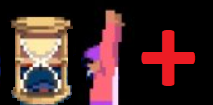

[](https://github.com/SergioMartin86/jaffarPlus/actions/workflows/make.yml) [](https://codecov.io/gh/SergioMartin86/jaffarPlus)

# JaffarPlus



**JaffarPlus is a high-performance, parallel search engine for producing tool-assisted speedruns (TAS).**

You point it at a game (through an emulation core), describe which inputs are legal and what "better"
means (a *reward*), and it explores the reachable game states across all of your CPU cores to find
the best input sequence it can — for a TAS, usually the fastest route to a win. It is a
*reward-guided breadth-first search*: it explores by increasing solution length, so the first
solution it finds is a shortest one, while always expanding the most promising states first.

## Highlights

* **Fast and parallel** — built for many-core CPUs, with NUMA-aware memory and hash-based
  deduplication of already-seen states so it scales to large search spaces.
* **Multi-platform** — one engine drives 15+ emulation cores: NES, SNES, Sega Genesis / Master
  System / Game Gear, Game Boy / Color / Advance, Atari 2600, Doom, Prince of Persia, and more.
* **Reward-guided** — you steer the search declaratively with rules, conditions, and *reward
  magnets* in a JSON config; no recompilation needed to retune a search.
* **Extensible** — adding a new game is dropping one header into `games/`; registration is fully
  automatic. Any emulator exposing save/load state + advance-frame can be wrapped behind a common API.
* **Reproducible** — every solution replays deterministically and can be rendered to frames or video
  for analysis.

## Quick start (no ROM required)

JaffarPlus ships a self-contained puzzle on its in-repo test core, so you can build and run a real
search on any machine:

```bash
# Build with the ROM-free test core
meson setup build -Demulator=TestEmulator
ninja -C build

# Validate the configuration, then run the search (finds the optimal 8-move path on a 5x5 grid)
./build/jaffar docs/examples/gridwalker.jaffar --dryRun
./build/jaffar docs/examples/gridwalker.jaffar

# Replay the solution it found
./build/jaffar-player docs/examples/gridwalker.jaffar /tmp/jaffar.gridwalker.best.sol \
    --reproduce --unattended --exitOnEnd
```

See **[Getting Started](docs/01-getting-started.md)** for the full walkthrough, including how to
build for a specific console core and game.

# Documentation

A complete user & developer manual lives in **[`docs/`](docs/README.md)**:

| Chapter | What it covers |
| ------- | -------------- |
| [1. Getting Started](docs/01-getting-started.md) | Build JaffarPlus, run your first search (no ROM), read the output, replay a solution. |
| [2. Configuration Reference](docs/02-config-reference.md) | Every section and key of a `.jaffar` file: type, default, and meaning. |
| [3. Rules, Conditions & Rewards](docs/03-rules-and-rewards.md) | Steering the search: properties, conditions, reward actions, and magnets (illustrated). |
| [4. Search Concepts & Tuning](docs/04-search-concepts.md) | How the search, state hashing, and NUMA/threading work — and which knobs to turn. |
| [5. Adding a Game or Emulator](docs/05-adding-a-game.md) | Register a new game or emulator and expose its properties and actions. |
| [6. Tooling Reference](docs/06-tooling.md) | `jaffar`, `jaffar-player`, headless screenshots, video rendering, environment overrides. |

A C++ **API reference** for the engine internals is generated from the source with Doxygen
(`doxygen Doxyfile` → `build/doxygen/html/`; also published as a CI artifact).

# Built-in Emulator Support

## Consoles

| Console                  | Core(s)                                                                      |
| --------                 | -------                                                                      |
| Atari 2600               | [QuickerStella](https://github.com/SergioMartin86/quickerStella)             |
| Atari 2600               | [Atari2600Hawk](https://github.com/CasualPokePlayer/libAtari2600Hawk)        |
| NES                      | [QuickerNES](https://github.com/SergioMartin86/quickerNES)                   |
| SNES                     | [QuickerSnes9x](https://github.com/SergioMartin86/quickerSnes9x)             |
| Sega Genesis             | [QuickerGPGX](https://github.com/SergioMartin86/quickerGPGX)                 |
| Sega CD                  | [QuickerGPGX](https://github.com/SergioMartin86/quickerGPGX)                 |
| Sega SG-1000             | [QuickerGPGX](https://github.com/SergioMartin86/quickerGPGX)                 |
| Sega Master System       | [QuickerGPGX](https://github.com/SergioMartin86/quickerGPGX)                 |
| Gameboy Advance          | [QuickerMGBA](https://github.com/SergioMartin86/quickerMGBA)                 |
| Gameboy / Gameboy Color  | [QuickerGambatte](https://github.com/SergioMartin86/quickerGambatte)         |

## Game-Specific

| Game                   | Core(s)                                                          | Target                       | Notes |
| ---------------------- | ---------------------------------------------------------------- | ---------------------------- | ----- |
| Prince of Persia       | [QuickerSDLPoP](https://github.com/SergioMartin86/quickerSDLPoP) | LibTAS+PCem                  | Many PoP ports share this same (Apple II / DOS) game logic |
| Another World          | [QuickerNEORAW](https://github.com/SergioMartin86/QuickerNEORAW) | DOS                          | This AW interpreter only works with DOS files |
| Another World          | [QuickerRAWGL](https://github.com/SergioMartin86/QuickerRAWGL)   | Multiple                     | This AW interpreter works with most AW ports |
| Super Mario Bros (NES) | [QuickerSMBC](https://github.com/SergioMartin86/quickerSMBC)     | Bizhawk 2.9.2                | Inaccurate in transitions, but good for solving levels |
| Arkanoid (NES)         | [QuickerArkbot](https://github.com/SergioMartin86/quickerArkBot) | Bizhawk 2.9.2 (NesHawk Core) | |
| Doom                   | [QuickerDSDA](https://github.com/SergioMartin86/quickerDSDA)     | Doom / Doom II               | |
| Sokoban                | [QuickerBan](https://github.com/SergioMartin86/quickerBan)       | Sokoban (all)                | |

Author
=============

- Sergio Martin (eien86)
  + Github: https://github.com/SergioMartin86
  + Twitch: https://www.twitch.tv/eien86
  + Youtube: https://www.youtube.com/channel/UCSXpK3d6vUq58fjgF5jFoKA
  + TASVideos: https://tasvideos.org/Users/Profile/eien86

- A list of TAS movies produced by eien86 using JaffarPlus can be found [here](https://tasvideos.org/Subs-List?user=eien86&statusfilter=6)

- Contributions via pull requests are highly appreciated.

- Thanks to:
  + This work is based on [Jaffar](https://github.com/SergioMartin86/jaffar), a solver for the original Prince of Persia (DOS).
  + TASVideos' staff (judges, encoders, admins, etc)
  + The Bizhawk development team (YoshiRulz, feos, Morilli, CasualPokePlayer, NattTheBear, Alyosha, feos, zeromus, and many others)
  + Dávid Nagy and all SDLPoP developers
  + Gregory Montoir and Fabien Sanglard (authors of Fabother World)
  + Eke-Eke and all Genesis Plus GX developers
  + Shay Green, Christopher Snowhill and all QuickNES developers
  + sbroger (a.k.a Chef Stef), developer of Arkbot
  + Mitchell Sternke, developer of SMB-C
  + sinamas, et al. for Gambatte-Speedrun
  + Vicki Pfau, et al. for MGBA
  + Alexander Lyashuk (mooskagh, crem) for kickstarting the idea of creating a TASing bot.
  + The authors of DSDA
  + The authors of the third party libraries used.

- JaffarPlus's own source code is distributed freely under the [MIT License](LICENSE) for any purpose and use, as long as:
  + The license and proper credits to its author are preserved
  + If you publish a TAS or any public work using this software, I'd appreciate you mention it and linking this repository in your description

- A note on the emulator cores: JaffarPlus builds against emulation cores that are included as
  separate git submodules and are licensed under the GPL (v2 or v3, depending on the core). The MIT
  license above covers only the source code in this repository. A binary you build links one of
  those cores and is therefore a derivative work under that core's GPL — so if you choose to
  distribute such a binary, it must be distributed under the corresponding GPL terms.
