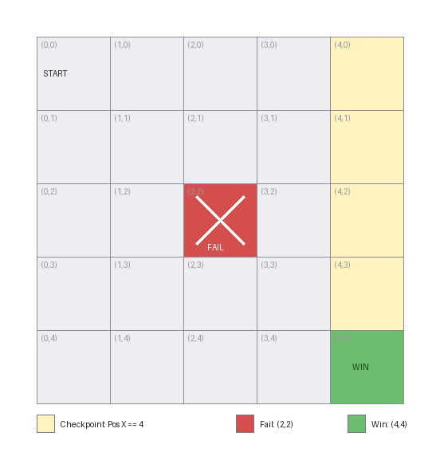
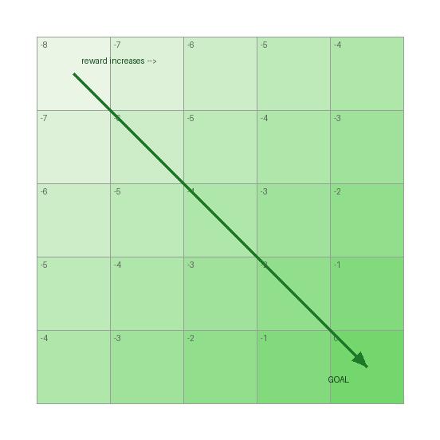
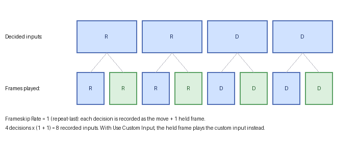

# 3. Rules, Conditions & Rewards

This is the chapter that turns JaffarPlus from "explores states" into "solves *your* problem". The
engine keeps a frontier of states and expands the most promising ones first; **you** define what
"promising" means through a *reward*, and what counts as winning, failing, or worth checkpointing
through *rules*. Get this right and a search that would never terminate becomes one that finds an
optimal solution in seconds.

> The figures in this chapter are schematic diagrams of the bundled **GridWalker** puzzle
> ([`docs/examples/gridwalker.jaffar`](examples/gridwalker.jaffar)): a cursor that moves Up/Down/
> Left/Right on a 5×5 grid, starting at the top-left `(0,0)` and trying to reach the bottom-right
> `(4,4)`. It runs on the ROM-free test core, so every rule and reward shown here is something you
> can run and reproduce yourself (see [Getting Started](01-getting-started.md)).

- [The mental model](#the-mental-model)
- [Properties: naming game memory](#properties-naming-game-memory)
- [Conditions](#conditions)
- [Rules](#rules)
- [Core actions](#core-actions)
- [The GridWalker rule set](#the-gridwalker-rule-set)
- [Reward shaping (and magnets)](#reward-shaping-and-magnets)
- [Checkpoints and tolerance](#checkpoints-and-tolerance)
- [Frame-skip](#frame-skip)
- [Design recipes](#design-recipes)

## The mental model

Every state the engine reaches has a single **reward** value (a `float`). The search keeps a frontier
of states and expands the highest-reward ones first. So:

- **Reward is a compass, not a score.** Its absolute value is irrelevant; only the *ordering* it
  induces matters. A state with higher reward gets explored sooner.
- **Reward has two sources.** Discrete bumps from rule **actions** (`Add Reward`), and any continuous
  gradient the game computes (for GridWalker, "closer to the goal is better"). The two are summed.
- **Rules also gate the search.** A rule can mark a state as a **win** (a solution), a **fail**
  (pruned, never expanded), or a **checkpoint** (a milestone).

A search succeeds when a state triggers a `Trigger Win`. It is your reward design that makes the
engine *walk toward* that win instead of wandering the entire state space.

## Properties: naming game memory

A **property** is a named, typed view into the game's memory. GridWalker exposes five
*(source: [`games/test/gridWalker.hpp`](../games/test/gridWalker.hpp))*:

| Property | Meaning |
|----------|---------|
| `Pos X`, `Pos Y` | The cursor's column and row — the only things that distinguish one state from another. |
| `Distance` | Manhattan distance from the cursor to the goal (a derived value). |
| `Steps` | How many moves have been made. |
| `Goal Reached` | Whether the cursor is on the goal cell. |

Properties are registered by the game's C++ code (not the config); the config refers to them by name
in three places:

- `Game Configuration` > `Hash Properties` — which properties define a state's *identity*. GridWalker
  hashes `Pos X` and `Pos Y`, so two routes that reach the same cell are treated as the same state.
- `Game Configuration` > `Print Properties` — which to show in status output.
- Inside **conditions** — to test a value.

To list a game's properties, read its header under `games/` or see
[Adding a Game](05-adding-a-game.md). Datatypes (`UINT8`…`FLOAT64`, `BOOL`) and endianness are in the
[Configuration Reference](02-config-reference.md#property-datatypes).

## Conditions

A condition is a single comparison: a property, an operator, and a value.

```json
{ "Property": "Pos X", "Op": "==", "Value": 4 }
```

- `Property` — the left operand (a registered property name).
- `Op` — one of `==`, `!=`, `>`, `>=`, `<`, `<=`, `%0`, `%N`, `BitTrue`, `BitFalse`.
  - `%0` / `%N`: property modulo `Value` is zero / non-zero.
  - `BitTrue` / `BitFalse`: the bit at index `Value` is set / clear.
- `Value` — the right operand. A **number** or **boolean** is an immediate value; a **string** is
  treated as *another property name*, so you can compare two properties (e.g. `Pos X` against `Pos Y`).

Conditions appear in two contexts, with identical grammar: inside a **rule** (when does this rule
fire?) and inside an **input set** (when is this input legal?). Within a single list, **all**
conditions must hold — they are AND-ed. There is no OR/NOT; express alternatives as separate rules
or input sets.

## Rules

A rule couples a set of conditions to a set of actions.

```json
{
  "Label": 200,
  "Conditions": [ { "Property": "Pos X", "Op": "==", "Value": 4 } ],
  "Satisfies": [],
  "Actions": [ { "Type": "Add Reward", "Value": 100.0 } ]
}
```

- `Label` — a unique number identifying the rule.
- `Conditions` — when all hold, the rule **fires**. An empty list means "always".
- `Actions` — what firing does (see below).
- `Satisfies` — labels of *other* rules to also mark as satisfied when this one fires. Use it to
  build hierarchies: satisfying a "level complete" rule can auto-satisfy the checkpoints leading up
  to it.

## Core actions

These five action `Type`s are available to every game *(source: `source/game.hpp`)*:

| `Type` | Extra keys | Effect |
|--------|-----------|--------|
| `Add Reward` | `Value` (number) | Add `Value` to the state's reward. Negative values penalize. |
| `Trigger Win` | — | This state is a solution; the search can stop (per `End On First Win State`). |
| `Trigger Fail` | — | Prune this state; it is never expanded. Use it to kill dead ends (death, out-of-bounds, a wrong room). |
| `Trigger Checkpoint` | `Tolerance` (number) | Record a milestone (see [below](#checkpoints-and-tolerance)). |
| `Trigger Save Solution` | `Path` (string) | Write the current solution to `Path` when the rule fires. Handy for capturing the route to a milestone mid-run. |

A game may register **additional** action types (most notably *reward magnets* — see
[below](#reward-shaping-and-magnets)), but GridWalker uses only these five, which is enough to
demonstrate every kind of rule.

## The GridWalker rule set

[`docs/examples/gridwalker.jaffar`](examples/gridwalker.jaffar) defines three rules that, between
them, exercise win, fail, checkpoint, save-solution, reward, and rule-chaining:

```json
"Rules": [
  { "Label": 100,
    "Conditions": [ {"Property":"Pos X","Op":"==","Value":2}, {"Property":"Pos Y","Op":"==","Value":2} ],
    "Actions": [ {"Type":"Trigger Fail"} ] },

  { "Label": 200,
    "Conditions": [ {"Property":"Pos X","Op":"==","Value":4} ],
    "Actions": [ {"Type":"Add Reward","Value":100.0},
                 {"Type":"Trigger Checkpoint","Tolerance":8},
                 {"Type":"Trigger Save Solution","Path":"/tmp/jaffar.gridwalker.win.sol"} ] },

  { "Label": 300,
    "Conditions": [ {"Property":"Pos X","Op":"==","Value":4}, {"Property":"Pos Y","Op":"==","Value":4} ],
    "Satisfies": [ 200 ],
    "Actions": [ {"Type":"Add Reward","Value":100000.0}, {"Type":"Trigger Win"} ] }
]
```

Mapped onto the grid, here is where each rule fires:



- **Rule 100 — `Trigger Fail` (red).** When the cursor is at the centre `(2,2)`, the state is pruned:
  the engine discards it and never explores any route continuing through it. This is how you forbid
  death, out-of-bounds, or known dead ends.
- **Rule 200 — checkpoint + reward + save (yellow column).** Reaching *any* cell in column `Pos X == 4`
  adds `+100` to the reward, records a `Trigger Checkpoint`, and writes the current route to disk with
  `Trigger Save Solution`. This is an intermediate milestone — a partial goal worth steering toward
  and worth capturing.
- **Rule 300 — `Trigger Win` (green).** Reaching the corner `(4,4)` adds a dominating `+100000` and
  marks the state a win. Its `Satisfies: [200]` also marks rule 200 as met, so arriving at the corner
  counts the column-4 milestone as achieved even if the win is reached first.

Because `Pos X` and `Pos Y` are the hash properties, the engine treats each grid cell as a single
state and returns the shortest (8-move) route — see
[Search Concepts](04-search-concepts.md#a-concrete-picture) for the depth/pruning/dedup view of the
very same puzzle.

## Reward shaping (and magnets)

Rules give *discrete* reward at specific cells (the `+100` in column 4, the `+100000` at the goal).
On top of that, GridWalker adds a *continuous* gradient: its reward decreases with distance to the
goal, so every step that gets closer is preferred. Shaded by reward, the grid looks like this:



This gradient is what makes the search *walk* toward the goal instead of expanding the grid
uniformly: between two equally-deep states, the one nearer the goal has higher reward and is expanded
first.

**Where do magnets come in?** GridWalker's gradient is hard-coded in its C++
(`calculateGameSpecificReward` returns `-Distance`). Richer games make the same idea *configurable*
by exposing **reward magnets** — game-specific actions that let you place such a gradient from the
`.jaffar` file, no recompiling. They take one of two shapes:

- **Point magnet** — pulls a positional property toward a target, e.g. Prince of Persia's
  `{"Type": "Set Kid Pos X Magnet", "Intensity": 1.0, "Position": 180}`. The contribution is
  `Intensity × −|current − Position|`: positive intensity pulls toward `Position`, negative pushes
  away. (This is exactly GridWalker's distance gradient, but tunable per state.)
- **Scalar magnet** — multiplies a single property by an intensity, e.g. `Set Level Door Open Magnet`
  (reward rises as a door opens). Takes only `Intensity`.

Magnets are *not* part of the engine core — each game registers its own in `parseRuleActionImpl`. To
see which a game supports, read that method (a chain of `if (actionType == "Set … Magnet")` blocks);
the naming is consistently `Set <Thing> Magnet`. GridWalker registers none, because its single fixed
gradient is all a 5×5 grid needs.

## Checkpoints and tolerance

`Trigger Checkpoint` records progress and carries a `Tolerance` (GridWalker uses `8`). Tolerance
interacts with deduplication: normally two states with the same `Hash Properties` are merged, but
right after a checkpoint the engine tolerates a number of additional steps before re-merging, so it
does not immediately discard the slightly-different states that branch off a milestone. Larger
tolerance = more states kept around a checkpoint = broader local search at the cost of memory. The
related global knob is `Runner Configuration` > `Hash Step Tolerance`
(see [Search Concepts & Tuning](04-search-concepts.md#hash-step-tolerance)).

## Frame-skip

A *decision* the search makes does not have to be a single emulator frame. With
`Runner Configuration` > `Frameskip` > `Rate > 0`, each chosen input is held for extra frames before
the next decision, so the search tree is shallower (fewer decisions) while the recorded solution
still contains every played frame:



On GridWalker with `Rate: 1` (repeat-last), each decision advances the cursor twice, so the corner is
reached in **4 decisions** but the saved solution records **8 inputs** — the move plus one held copy
each. With `Use Custom Input`, the held frames play a fixed `Custom Input` (e.g. a no-op) instead of
repeating the decision. Frame-skip trades search precision for depth and is most useful on long
traversals where single-frame timing does not matter; the keys are detailed in the
[Configuration Reference](02-config-reference.md#runner-configuration--frameskip) and the trade-off
in [Search Concepts](04-search-concepts.md#tuning-checklist).

## Design recipes

- **Make the win dominate.** Give `Trigger Win` (or the rule leading to it) a reward far larger than
  any intermediate bonus, so a winning route always sorts to the front — GridWalker's `+100000`
  versus the `+100` checkpoint is exactly this.
- **Prune aggressively.** Every `Trigger Fail` removes a whole subtree from the search. Death, a
  wrong room, unrecoverable HP loss — fail them early.
- **Shape, then bump.** Let a continuous gradient (a built-in distance reward, or a standing magnet)
  pull the search toward the goal, and use `Add Reward` rules for sharp bonuses at milestones
  (gates, keys, checkpoints).
- **Watch the state explosion.** Hashing noisy properties (timers, RNG, cosmetic counters) makes
  near-identical states look different and floods the database. Keep `Hash Properties` minimal —
  GridWalker hashes only `Pos X`/`Pos Y`. (For games with cosmetic RNG, such as Prince of Persia,
  there is usually an emulator option to suppress it; see the
  [Configuration Reference](02-config-reference.md#emulator-configuration).)

The next chapter explains *why* these choices affect performance — how the search, hashing,
deduplication, and the state database actually work.
