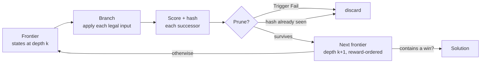
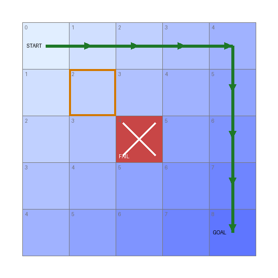
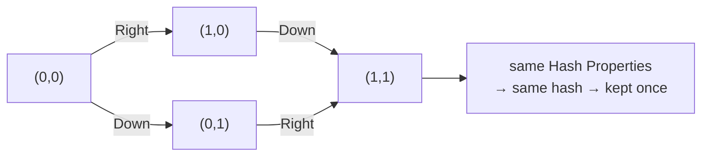

# 4. Search Concepts & Tuning

This chapter explains what the engine actually does with your configuration — enough to diagnose a
search that is too slow, runs out of memory, or "runs out of states" before finding a solution. It
is useful to users tuning a search and to contributors working on the engine.

- [The search loop](#the-search-loop)
- [States and the state database](#states-and-the-state-database)
- [Hashing and deduplication](#hashing-and-deduplication)
  - [Choosing hash properties](#choosing-hash-properties)
  - [Hash step tolerance](#hash-step-tolerance)
- [The NUMA / threading model](#the-numa--threading-model)
- [Tuning checklist](#tuning-checklist)
- [Environment overrides](#environment-overrides)

## The search loop

JaffarPlus performs a **best-first breadth search**. The *breadth* part: it advances one **step**
(one unit of depth) at a time, expanding the entire current frontier of states before moving on to
the next depth. The *best-first* part: within that, it orders states by reward so the most promising
ones are expanded and kept first. One step does this:

1. **Take the frontier** — every state discovered at the current depth.
2. **Branch** — for each state, apply every legal input (from `Allowed Input Sets`), advancing the
   emulator one frame (plus any frame-skip) to produce one successor state per input.
3. **Score & hash** — compute each successor's reward (rules + magnets) and a hash of its
   `Hash Properties`.
4. **Prune** — discard successors marked `Trigger Fail`, and discard any whose hash was already
   seen ([deduplication](#hashing-and-deduplication)).
5. **Advance** — the survivors become the next frontier, reward-ordered. Repeat from step 1.

Because every state at depth *k* is expanded before any at depth *k+1*, **the first win reached is
reached by a shortest input sequence** — the fastest route, which is the whole point of a TAS.
Reward changes the *order and priority* of exploration (and which state is reported as best), not
the depth at which a solution is first found. This is why the GridWalker test asserts an
exactly-8-move solution regardless of thread count: different runs may surface a *different* 8-move
path, but never a shorter or longer optimum.

### A concrete picture

The bundled GridWalker puzzle makes this tangible. A cursor starts at the top-left `(0,0)` of a 5×5
grid and must reach `(4,4)`; the only thing that distinguishes one state from another (its
`Hash Properties`) is the cursor's `(Pos X, Pos Y)`. Each cell below is labelled with its **depth**
— the fewest moves needed to reach it — and shaded darker as depth grows, so each diagonal band is
one frontier the search expands in turn:

- **Depth ordering → shortest path.** The goal sits at depth 8 (`4 + 4`), so the optimal solution is
  8 moves. Since the search only reaches depth 8 after exhausting depths 0–7, the first win it finds
  *is* one of those 8-move paths (green).
- **Pruning.** A rule fails the centre cell `(2,2)` (`Trigger Fail`, red ✕); the search discards it
  immediately and never explores anything beyond it.
- **Deduplication.** The outlined cell `(1,1)` is reachable two ways — right-then-down or
  down-then-right — but both produce the *same* `(Pos X, Pos Y)`, hash identically, and collapse to
  one state. Without this, the number of input *paths* grows exponentially with depth; with it, the
  search is bounded by the number of distinct *states* (here, at most 25 cells). This collapse is
  what makes the search tractable, and it is the subject of the next section.

## States and the state database

A **state** is the serialized, searched portion of the game at one point in time. Its size is the
dominant factor in how many states fit in memory and how fast each one is copied/hashed.

The **state database** (`Engine Configuration` > `State Database` > `Max Size (Mb)`) is the memory
pool holding the frontier. When it fills, the engine cannot admit new states; if the frontier
empties before a win, the run ends with **`Engine ran out of states.`** That message means one of:

- there is genuinely no solution under your inputs/rules (e.g. an over-aggressive `Trigger Fail`),
- the state database is too small to hold the frontier needed to reach the win, or
- each state is larger than it needs to be (see [making states smaller](#making-states-smaller)).

The state database is partitioned per **NUMA domain** (see [below](#the-numa--threading-model)); the
`Max Size (Mb)` budget is shared across domains.

### Making states smaller

Smaller states mean more of them fit and each is processed faster. Two levers:

- **`Disabled State Properties`** (in the emulator section) excludes save-state memory blocks that
  don't affect the search (e.g. video/CHR memory, audio state). This is the biggest single win for
  most console cores — dropping a large unused block can shrink state size dramatically.
- **`Bypass Emulator State`** / game-managed state — advanced; lets a game serialize only the bytes
  it cares about.

## Hashing and deduplication

To avoid exploring the same situation twice, the engine hashes each state and skips any hash it has
already seen. Concretely, the two ways of reaching `(1,1)` in the grid above converge to a single
state:

The **hash database** (`Engine Configuration` > `Hash Database`) stores those hashes:

- `Enabled` — turn deduplication on (almost always yes).
- `Max Store Size (Mb)` — memory budget for stored hashes.
- `Max Store Count` — how many rolling generations of the hash store to retain before old ones are
  retired. More generations remember states longer (fewer re-explorations) at higher memory cost.

Internally the hash store is tiered (a fast per-domain layer in front of a shared global layer) so
that the common "have I seen this?" check stays cheap under many threads. As a user you control it
only through the two size/count keys above and through *what* gets hashed:

### Choosing hash properties

`Game Configuration` > `Hash Properties` is the most important correctness/performance lever you
control directly. It defines a state's **identity**: two states whose hash-property values match are
considered the same and deduplicated.

- **Too few / too coarse** → distinct situations collide and get discarded; the engine may miss the
  solution.
- **Too many / too noisy** → situations that are *effectively* identical look different; the state
  count explodes and you run out of memory.

Hash exactly the properties that matter to the outcome (position, room, HP, key game flags) and
nothing cosmetic (animation frames, RNG, timers you don't care about). For Prince of Persia, this is
why `Disable Non-Gameplay RNG` matters: it stops torch/animation RNG churn from making otherwise
identical states hash differently.

### Hash step tolerance

`Runner Configuration` > `Hash Step Tolerance` controls how eagerly states are re-hashed across
consecutive steps. `0` hashes every step (maximum precision, maximum state count). A higher value
lets a state persist for a few steps before being re-considered for deduplication, collapsing
near-identical successive frames — fewer states, faster, at the risk of skipping over a
fine-grained distinction. Start at `0`; raise it only if the state count is unmanageable and you've
confirmed the lost precision doesn't drop the solution. (`Trigger Checkpoint` carries its own
per-milestone `Tolerance`, described in [chapter 3](03-rules-and-rewards.md#checkpoints-and-tolerance).)

## The NUMA / threading model

JaffarPlus is built for many-core machines. It parallelizes state expansion across OpenMP threads,
and it is **NUMA-aware**: on a multi-socket / multi-domain machine, each NUMA domain gets its own
slice of the state database, and one thread per domain acts as that domain's *delegate* for
allocating the domain-local queues. This keeps each thread working mostly on memory close to it.

*(Source: `source/numa.hpp`, `source/stateDb.hpp`.)*

Practical consequences:

- **Thread count** comes from OpenMP (`OMP_NUM_THREADS`), or can be overridden with the
  `JAFFAR_ENGINE_OVERRIDE_MAX_THREAD_COUNT` environment variable. With one thread the engine
  collapses to a single NUMA domain.
- **Pin your threads** on production runs (`OMP_PROC_BIND=true`/`close`, or `taskset`). Unpinned or
  oversubscribed threads can share cores; the engine identifies domains by the OpenMP thread id
  (dense and unique) precisely so that core-sharing does not corrupt domain assignment, but pinning
  still gives the best and most reproducible performance.
- **Determinism of depth, not path.** More threads can surface a different optimal path, but
  best-first search guarantees the same optimal *depth*.

## Tuning checklist

When a search is too slow or runs out of states, work down this list:

1. **Shrink the state.** Add unused memory blocks to `Disabled State Properties`. Biggest single
   win on most cores.
2. **Tighten `Hash Properties`.** Remove anything cosmetic/noisy. For PoP, set
   `Disable Non-Gameplay RNG`.
3. **Tighten `Allowed Input Sets`.** Fewer legal inputs per state = lower branching factor. Gate
   inputs with conditions so only sensible moves are tried in each situation.
4. **Prune with `Trigger Fail`.** Kill dead ends (death, wrong room) early.
5. **Steer with a magnet.** A standing magnet toward the goal focuses the frontier instead of
   exploring uniformly.
6. **Give the databases room.** Raise `State Database` > `Max Size (Mb)` and the `Hash Database`
   budgets if you have RAM to spare.
7. **Consider frame-skip.** A non-zero `Frameskip` > `Rate` searches coarser but advances faster;
   useful for long traversals where single-frame precision isn't needed.
8. **Use all your cores, pinned.** Set `OMP_NUM_THREADS` and pin them.

## Environment overrides

Several settings can be overridden at runtime via environment variables, primarily for testing and
benchmarking without editing the config:

| Variable | Overrides |
|----------|-----------|
| `JAFFAR_DRIVER_OVERRIDE_DRIVER_MAX_STEP` | `Driver Configuration` > `Max Steps` |
| `JAFFAR_ENGINE_OVERRIDE_MAX_STATEDB_SIZE_MB` | `Engine Configuration` > `State Database` > `Max Size (Mb)` |
| `JAFFAR_ENGINE_OVERRIDE_MAX_HASHDB_SIZE_MB` | `Engine Configuration` > `Hash Database` > `Max Store Size (Mb)` |
| `JAFFAR_ENGINE_OVERRIDE_MAX_THREAD_COUNT` | OpenMP thread count |
| `JAFFAR_IS_DRY_RUN` | Set internally by `--dryRun`; skips the NUMA check and trace-file loading during config validation |

See the [Tooling Reference](06-tooling.md) for the command-line flags.
